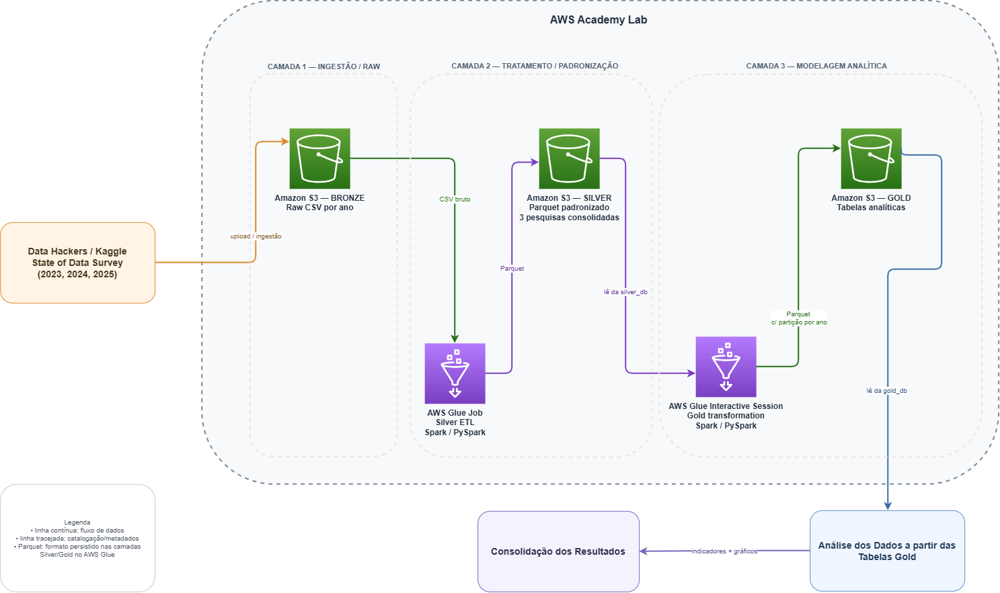

# Tech Challenge - State of Data Brasil | Fase 3

> Pipeline de ETL em AWS + análise exploratória do **State of Data Survey Brasil**, com arquitetura em camadas **Bronze, Silver e Gold** e uso de **AWS Glue, Apache Spark / PySpark, Amazon S3 e Glue Data Catalog**.

---

## 1. Sobre o projeto

Este repositório contém a solução desenvolvida para o **Tech Challenge (Fase 3)** da pós-graduação em Data Analytics da FIAP, com foco na construção de um pipeline de dados em Cloud e na aplicação de Analytics sobre as três edições mais recentes do **State of Data Survey Brasil**.

O projeto foi desenvolvido para responder a um problema de negócio de uma instituição financeira que deseja compreender o mercado brasileiro de Dados e utilizar essas evidências para apoiar decisões relacionadas a:

- contratação e atração de profissionais;
- capacitação e desenvolvimento de talentos;
- adoção de tecnologias e Inteligência Artificial;
- modelos de trabalho;
- remuneração;
- diversidade;
- investimentos em Dados, Analytics e IA.

A análise consolida as edições **2023, 2024 e 2025**, totalizando **14.002 respondentes**.

---

## 2. Objetivos

### Objetivo geral

Construir uma solução analítica completa, desde a ingestão dos dados brutos até a geração de informações para tomada de decisão, utilizando serviços AWS e processamento distribuído com Spark.

### Objetivos específicos

1. Organizar os dados brutos das pesquisas em uma camada **Bronze** no Amazon S3.
2. Aplicar tratamento, padronização e transformação na camada **Silver** utilizando AWS Glue e Spark/PySpark.
3. Modelar os dados analíticos na camada **Gold**, estruturando fatos e dimensões para consultas e análises.
4. Catalogar as tabelas utilizando o **AWS Glue Data Catalog**.
5. Explorar os dados das três edições do survey para identificar padrões, tendências e diferenças relevantes.
6. Responder às sete questões de negócio propostas no Tech Challenge.
7. Transformar os resultados em insights e recomendações estratégicas por meio de DataViz e Storytelling.

---

## 3. Fonte dos dados

**Fonte:** State of Data Survey Brasil - Data Hackers / Bain

**Edições utilizadas:** 2023, 2024 e 2025

**Fonte dos datasets:** [Data Hackers - Kaggle](https://www.kaggle.com/datahackers/datasets)

### Volume analisado

| Edição | Respondentes |
|---|---:|
| 2023 | 5.293 |
| 2024 | 5.215 |
| 2025 | 3.494 |
| **Total** | **14.002** |

> **Nota:** a quantidade de respondentes varia de acordo com a pergunta, especialmente nas questões de múltipla escolha. Por isso, os indicadores analíticos no material executivo utilizam o denominador específico de cada bloco de pergunta.

---

## 4. Arquitetura da solução

A solução utiliza uma arquitetura de Data Lake em três camadas:

- **Bronze:** dados brutos, preservando os arquivos originais organizados por ano;
- **Silver:** dados tratados, padronizados e persistidos em Parquet;
- **Gold:** dados modelados para análise, organizados em tabelas fato e dimensão.

### Fluxo da arquitetura

```text
Data Hackers / Kaggle
        |
        | upload / ingestão
        v
Amazon S3 - BRONZE
Raw CSV por ano
        |
        | CSV bruto
        v
AWS Glue Job
Silver ETL - Spark / PySpark
        |
        | Parquet
        v
Amazon S3 - SILVER
Dados tratados e consolidados
        |
        | leitura via Glue Data Catalog
        v
AWS Glue Interactive Session
Gold transformation - Spark / PySpark
        |
        | Parquet + partição por ano
        v
Amazon S3 - GOLD
Tabelas analíticas
        |
        v
Consumo analítico
Indicadores e gráficos
        |
        v
Material executivo
DataViz + Storytelling
```

### Diagrama AWS

O diagrama editável da arquitetura foi desenvolvido no **Draw.io** e representa o fluxo efetivamente utilizado no projeto.



---

## 5. Serviços e tecnologias utilizados

### Cloud / AWS

- **Amazon S3** - armazenamento das camadas Bronze, Silver e Gold;
- **AWS Glue Jobs** - processamento da camada Silver;
- **AWS Glue Interactive Session** - processamento da camada Gold;
- **AWS Glue Data Catalog** - catalogação e descoberta das tabelas analíticas;
- **AWS Academy Lab** - ambiente de execução do projeto.

### Processamento e Analytics

- **Apache Spark**;
- **PySpark**;
- **AWS Glue DynamicFrame / DataFrame**;
- **Python**;
- **Jupyter Notebook / Glue Notebook**.

### Visualização e documentação

- PDF executivo com DataViz e Storytelling;
- Draw.io para arquitetura;
- Documentação analítica consolidada.

---

## 6. Estrutura do repositório

```text
state-of-data-survey-analysis/
│
├── bronze/
│   └── state_of_data/
│       ├── ano=2023/
│       │   └── df_survey.csv
│       ├── ano=2024/
│       │   └── df_survey.csv
│       └── ano=2025/
│           └── df_survey.csv
│
├── silver/
│   ├── mapeamento_colunas_completo.csv
│   ├── transform_silver_state_of_data.py
│   └── state_of_data/
│       ├── pesquisa_2023/
│       ├── pesquisa_2024/
│       └── pesquisa_2025/
│
├── gold/
│   ├── transform_gold_state_of_data.ipynb
│   ├── tbl_dimensao_faixa_salarial/
│   ├── tbl_fato_experiencia/
│   ├── tbl_fato_gestao/
│   ├── tbl_fato_ia_generativa/
│   ├── tbl_fato_perfil_profissional/
│   ├── tbl_fato_rotina/
│   ├── tbl_fato_satisfacao/
│   ├── tbl_fato_tecnologias/
│   └── tbl_fato_time_dados/
│
├── documentos/
│   └── TechChallenge3_Arquitetura.drawio.png
│
├── analises/
│
└── README.md
```

> Os arquivos disponibilizados no repositório funcionam como snapshots para inspeção e versionamento. No ambiente AWS, as camadas Silver e Gold são persistidas em **Parquet**.

---

## 7. Pipeline de dados

### 7.1 Bronze - ingestão e armazenamento

Os datasets das edições 2023, 2024 e 2025 são organizados no Amazon S3 em uma estrutura particionada por ano:

```text
bronze/state_of_data/ano=2023/
bronze/state_of_data/ano=2024/
bronze/state_of_data/ano=2025/
```

A camada Bronze preserva o dado bruto e constitui o ponto de entrada do pipeline de transformação.

### 7.2 Silver - tratamento e padronização

O script `silver/transform_silver_state_of_data.py` realiza o tratamento dos dados utilizando **AWS Glue + Spark/PySpark**.

Entre as principais etapas estão:

- leitura dos arquivos da camada Bronze no S3;
- padronização dos nomes das colunas;
- tratamento de valores nulos e strings vazias;
- padronização de tipos e campos categóricos;
- tratamento e validação de idade;
- tratamento de faixa salarial;
- deduplicação;
- inclusão do ano da pesquisa;
- criação de atributos de controle;
- persistência da camada Silver em Parquet;
- atualização do AWS Glue Data Catalog.

As três pesquisas são mantidas separadas por ano no catálogo:

```text
silver_db.tbl_state_of_data_2023
silver_db.tbl_state_of_data_2024
silver_db.tbl_state_of_data_2025
```

### 7.3 Gold - modelagem analítica

O notebook `gold/transform_gold_state_of_data.ipynb` lê as tabelas Silver por meio do **Glue Data Catalog** e realiza a transformação dos dados para consumo analítico.

As principais estruturas geradas são:

- `tbl_fato_perfil_profissional`
- `tbl_dimensao_faixa_salarial`
- `tbl_fato_tecnologias`
- `tbl_fato_experiencia`
- `tbl_fato_ia_generativa`
- `tbl_fato_gestao`
- `tbl_fato_time_dados`
- `tbl_fato_satisfacao`
- `tbl_fato_rotina`

As tabelas Gold são persistidas em Parquet no S3 e catalogadas no banco `gold_db`.

### 7.4 Tratamento de perguntas de múltipla escolha

Grande parte do State of Data Survey possui perguntas em que o respondente pode selecionar múltiplas opções.

Para essas variáveis, o projeto utiliza uma transformação de **unpivot** padronizada, convertendo indicadores distribuídos em diversas colunas para uma estrutura analítica em linhas.

Exemplo conceitual:

```text
respondente_id | ano | categoria    | item
---------------|-----|--------------|----------------
123            | 2025| linguagem    | SQL
123            | 2025| linguagem    | Python
123            | 2025| linguagem    | R
```

Essa estratégia facilita agregações, contagens e comparação entre categorias e anos.

---

## 8. Modelo analítico da camada Gold

A camada Gold foi organizada priorizando estruturas de fatos e dimensões adequadas às perguntas de negócio.

### Principais tabelas

| Tabela | Finalidade |
|---|---|
| `tbl_fato_perfil_profissional` | Perfil demográfico e profissional dos respondentes |
| `tbl_dimensao_faixa_salarial` | Faixas de remuneração e apoio à estimativa salarial |
| `tbl_fato_tecnologias` | Linguagens, bancos, BI, cloud e tecnologias utilizadas |
| `tbl_fato_experiencia` | Aspectos da experiência profissional |
| `tbl_fato_ia_generativa` | Uso pessoal, uso corporativo e barreiras relacionadas à IA |
| `tbl_fato_gestao` | Desafios e responsabilidades de gestores de Dados |
| `tbl_fato_time_dados` | Composição das equipes de Dados |
| `tbl_fato_satisfacao` | Critérios de escolha e motivos de insatisfação |
| `tbl_fato_rotina` | Atividades e rotinas profissionais |

---

## 9. Questões de negócio respondidas

A análise foi estruturada para responder às sete questões estabelecidas no Tech Challenge.

### 1. Como está estruturado o mercado brasileiro de Dados?

Foram analisados setor de atuação, porte das empresas, distribuição regional, senioridade, gênero e modelo de trabalho.

### 2. Quais perfis profissionais são mais valorizados pelo mercado?

Foram comparados o volume de profissionais por cargo e a remuneração estimada por cargo e senioridade.

> O dataset não contém número de vagas abertas, taxa de contratação ou turnover. Portanto, “valorização” é analisada de forma indireta a partir da presença na base e da remuneração estimada.

### 3. Qual é o cenário de diversidade de gênero nas carreiras de Dados?

Foram avaliados composição por gênero, evolução temporal, distribuição por senioridade, remuneração e percepção de prejuízo de carreira associado a gênero e raça.

### 4. Quais tecnologias apresentam maior adoção entre os profissionais?

Foram analisadas linguagens de programação, bancos/armazenamento, ferramentas de BI, cloud e técnicas utilizadas por cientistas de dados.

### 5. Qual é o índice de adoção de Inteligência Artificial e seu impacto?

Foram analisados uso pessoal de IA generativa, adoção no ambiente de trabalho, prioridade estratégica e principais barreiras à adoção.

> A pesquisa permite avaliar adoção e percepção organizacional, mas não permite inferir impacto causal da IA sobre produtividade, remuneração ou performance empresarial.

### 6. Existem diferenças relevantes entre regiões, senioridades ou modelos de trabalho?

Foram comparadas distribuição e remuneração por região e senioridade, além da remuneração e evolução dos modelos remoto, híbrido e presencial.

### 7. Quais oportunidades e desafios podem ser identificados para empresas que desejam investir em Dados e IA?

Os achados foram traduzidos em recomendações relacionadas a atração e retenção de talentos, flexibilidade, carreira, maturidade analítica, capacitação em IA, qualidade de dados, governança e diversidade.

---

## 10. Principais achados

Entre os principais resultados da análise consolidada:

- **14.002 respondentes** nas edições 2023–2025;
- **62,3%** dos respondentes estão no Sudeste;
- **44,6%** trabalham em empresas com mais de 3.000 funcionários;
- profissionais Pleno e Sênior representam **72,6%** da base;
- **23,5%** dos respondentes são mulheres;
- a participação feminina caiu de **24,4% em 2023 para 22,0% em 2025**;
- **SQL (89,5%)** e **Python (85,3%)** são as linguagens mais utilizadas;
- **Power BI (65,1%)** lidera entre as ferramentas de BI analisadas;
- **AWS (45,9%)** é a cloud preferida entre os respondentes considerados;
- o percentual que declara não usar IA para produtividade caiu de **19,7% em 2023 para 2,1% em 2025**;
- **36,8%** apontam falta de expertise/recursos como barreira à adoção de IA;
- **36,0%** apontam falta de casos de uso claros;
- **33,1%** apontam dados não preparados para IA como barreira;
- remuneração aparece como principal critério de escolha de emprego, com **81,9%**;
- entre os insatisfeitos, **45,1%** citam salário abaixo do mercado e **40,4%** apontam falta de oportunidade de crescimento.

> Consulte o material executivo para gráficos, recortes metodológicos e interpretação detalhada dos indicadores.

---

## 11. Equipe

**Analistas de Dados**

- Tiago Antônio dos Santos
- Isabele Cristina Felix Santos
- Thais Marcondes Narbonne

---

## 12. Conclusão

O projeto integra **Engenharia de Dados em Cloud, processamento distribuído e Analytics**, transformando os dados brutos do State of Data Survey Brasil em estruturas analíticas organizadas e indicadores para tomada de decisão.

A arquitetura em **Bronze → Silver → Gold** permite separar ingestão, tratamento e consumo analítico, enquanto o uso de **AWS Glue, Spark/PySpark, Amazon S3 e Glue Data Catalog** demonstra o ciclo completo de preparação e disponibilização dos dados em ambiente Cloud.

Os resultados finais são utilizados para construir uma visão do mercado brasileiro de Dados e gerar recomendações relacionadas a **talentos, tecnologias, IA, remuneração, diversidade e modelos de trabalho**.
